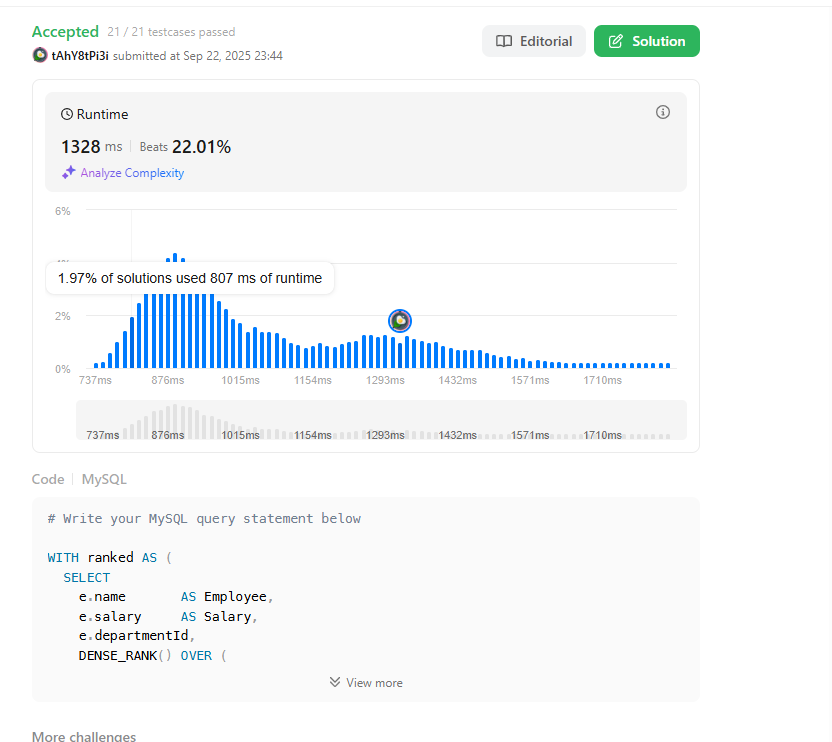
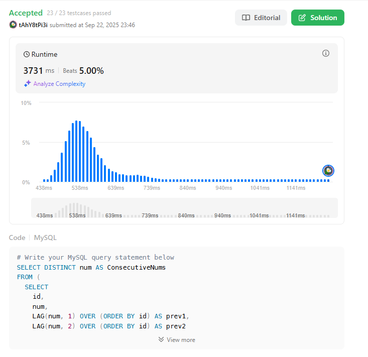
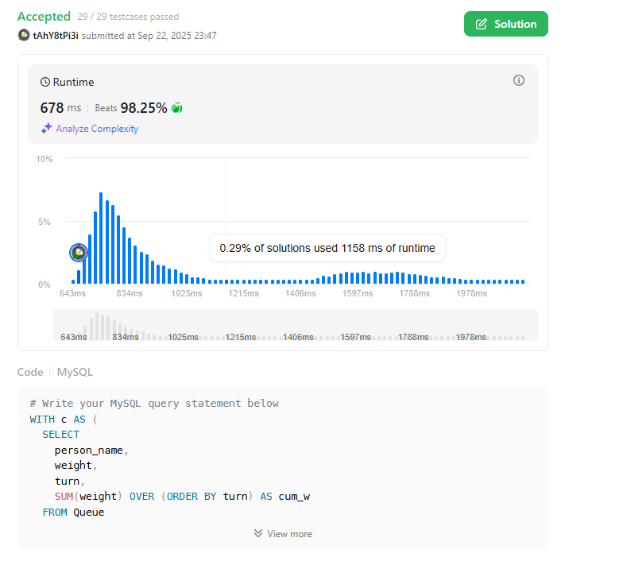

# SQL_ADVANCED 3주차 정규 과제 

## Week 3: 윈도우 함수 (Window Functions)

📌**SQL_ADVANCED 정규과제**는 매주 정해진 주제에 따라 **MySQL 공식 문서 또는 한글 블로그 자료를 참고해 개념을 정리한 후, 이번 주차에는 LeetCode SQL 문제 3문제**와 **추가 확인문제**를 직접 풀어보며 학습하는 과제입니다. 

이번 주는 아래의 **SQL_ADVANCED_3rd_TIL**에 나열된 주제를 중심으로 개념을 학습하고, 주차별 **학습 목표**에 맞게 정리해주세요. 정리한 내용은 GitHub에 업로드한 후, **스프레드시트의 'SQL' 시트에 링크를 제출**해주세요. 


**(수행 인증샷은 필수입니다.)** 

> Leet code의 문제를 풀고 '정답입니다' 문구를 캡쳐해서 올려주시면 됩니다. 


## SQL_ADVANCED_3rd

### 14.20.2 Window Function Concepts and Syntax

### 14.20.1 Window Function Description

### 14.19.1 Aggregate Function Descriptions

- 위 문서 중 *14.19.1. Aggregate Function Descriptions* 문서에서 1주차 (집계 함수) 에서 다룬 부분을 제외하고 **OVER( ) 절을 활용한 윈도우 함수 문법과 `RANK( ), DENSE_RANK( ), ROW_NUMBER( ), LAG( ), LEAD( )`등 윈도우 함수 특유의 기능 중심으로 정리해주세요.**


## 🏁 강의 수강 (Study Schedule)

| 주차  | 공부 범위               | 완료 여부 |
| ----- | ----------------------- | --------- |
| 1주차 | 서브쿼리 & CTE          | ✅         |
| 2주차 | 집합 연산자 & 그룹 함수 | ✅         |
| 3주차 | 윈도우 함수             | ✅         |
| 4주차 | Top N 쿼리              | 🍽️         |
| 5주차 | 계층형 질의와 셀프 조인 | 🍽️         |
| 6주차 | PIVOT / UNPIVOT         | 🍽️         |
| 7주차 | 정규 표현식             | 🍽️         |


### 공식 문서 활용 팁

>  **MySQL 공식 문서는 영어로 제공되지만, 크롬 브라우저에서 공식 문서를 열고 이 페이지 번역하기에서 한국어를 선택하면 번역된 버전으로 확인할 수 있습니다. 다만, 번역본은 문맥이 어색한 부분이 종종 있으니 영어 원문과 한국어 번역본을 왔다 갔다 하며 확인하거나, 교육팀장의 정리 예시를 참고하셔도 괜찮습니다.**


# 1️⃣ 학습 내용

> 아래의 링크를 통해 *MySQL 공식문서*로 이동하실 수 있습니다.
>
> - 14.20.2 Window Function Concepts and Syntax : MySQL 공식문서
>
> https://dev.mysql.com/doc/refman/8.0/en/window-functions-usage.html
>
> (한국어 버전) https://dart-b-official.github.io/posts/mysql-Window-Function/
>
> - 14.20.1 Window Function Description : MySQL 공식문서
>
> https://dev.mysql.com/doc/refman/8.0/en/window-function-descriptions.html
>
> (한국어 버전) https://dart-b-official.github.io/posts/mysql-Window-Function(2)/
>
> - 14.19.1 Aggregate Function Descriptions : MySQL 공식문서
>
> https://dev.mysql.com/doc/refman/8.0/en/aggregate-functions.html
>
> (한국어 버전) https://dart-b-official.github.io/posts/mysql-aggregate_function/
>

<br>


---

# 2️⃣ 학습 내용 정리하기

## 1. 윈도우 함수

~~~
✅ 학습 목표 :
* OVER 절을 통해 행 단위 분석을 가능하게 하는 윈도우 함수의 구조를 이해한다.
* RANK, DENSE_RANK, ROW_NUMBER의 차이를 구분하고 사용할 수 있다.
* 이전 또는 이후 행을 참조하는 LAG, LEAD 함수를 적절히 사용할 수 있다.
~~~

### 1) 핵심 개념
- **정의**: `OVER()` 절로 정의한 “윈도우(행 집합)”에 대해, **각 행마다** 값을 계산해 반환하는 함수.
- **일반 집계와 차이**  
  - 일반 집계: 여러 행 → **1행**으로 축약 (`SUM()`, `COUNT()` 등)  
  - 윈도우: 여러 행을 보되, **각 행에 결과를 붙임** (원본 행 유지)
- **사용 위치**: `SELECT` 리스트, `ORDER BY` 절에서만 사용 가능
- **실행 순서**: `FROM → WHERE → GROUP BY → HAVING → (WINDOW) → ORDER BY → LIMIT`

### 2) OVER 절 문법
```sql
<win_func>() OVER (
  [PARTITION BY expr_list]
  [ORDER BY sort_key [ASC|DESC] [NULLS FIRST|LAST]]
  [frame_clause]  -- 누적/슬라이딩 집계에 사용
)
```
- PARTITION BY: 그룹 경계를 정의
- ORDER BY: 파티션 내 계산 순서를 정의
- frame_clause: 누적합/이동평균 등에 쓰는 프레임

### 3) 랭킹함수 비교 
| 함수             | 동점 처리               | 예시(정렬: 10, 10, 9, 7) | 설명                    |
| -------------- | ------------------- | -------------------- | --------------------- |
| `ROW_NUMBER()` | 동점 무시(무조건 1,2,3,4…) | 1, 2, 3, 4           | **중복 없는 일련번호**가 필요할 때 |
| `RANK()`       | **갭 발생**            | 1, 1, 3, 4           | 동점 그룹 뒤에 **순위 건너뜀**   |
| `DENSE_RANK()` | **갭 없음**            | 1, 1, 2, 3           | 동점 그룹 뒤에 **연속 순위**    |

```sql
SELECT
  DENSE_RANK() OVER (PARTITION BY country ORDER BY profit DESC) AS dr
FROM sales;
```

**전/후 행 참조**
```sql
SELECT
  profit,
  LAG(profit, 1, 0)  OVER (PARTITION BY country ORDER BY year) AS prev_profit,
  LEAD(profit, 1, 0) OVER (PARTITION BY country ORDER BY year) AS next_profit
FROM sales;
```
- LAG : 이전 행 값, LEAD : 이후 행 값
- offset : 기본 1, 범위를 벗어나면 NULL
---

# 3️⃣ 실습 문제

## LeetCode 문제 

https://leetcode.com/problems/department-top-three-salaries/

> LeetCode 185. Department Top Three Salaries 
>
> 학습 포인트 : DENSE_RANK( ) + PARTITION BY 사용으로 그룹 내 상위 N개 추출

https://leetcode.com/problems/consecutive-numbers/

> LeetCode 180. Consecutive Numbers 
>
> 학습 포인트 : LAG( ) 함수로 이전 값과 비교하여 연속 데이터 탐지 

https://leetcode.com/problems/last-person-to-fit-in-the-bus/

> LeetCode 2481. Last Person to Fit in the Bus 
>
> 학습 포인트 : SUM( ) OVER (ORDER BY ...) 로 누적 합계 계산 후 조건 필터링 


문제를 푸는 다양한 방법이 존재하지만, **윈도우 함수를 사용하여 해결하는 방식에 대해 고민해주시길 바랍니다.** 

---

## 문제 인증란








---

# 확인문제

## 문제 1

> **🧚예린이는 고객별로 얼마나 많은 주문을 하는지 분석하기 위해, 고객의 주문 목록에 주문 순서를 표시하는 쿼리를 작성해보았습니다. 이때 주문일 순서대로 각 고객의 주문 번호를 매기기 위해 윈도우 함수를 활용했습니다.**

~~~sql
SELECT customer_id, order_id, order_date,
       ROW_NUMBER() OVER (PARTITION BY customer_id ORDER BY order_date) AS order_rank
FROM Orders;
~~~

> **이번에는 예린이에게 "윈도우 함수를 쓰지 않고 동일한 결과를 만들어보라"는 미션을 받았습니다. 예린이는 이 작업을 어떻게 해야할지 막막합니다. 예린이를 도와 ROW_NUMBER() 윈도우 함수 없이 동일한 결과를 서브쿼리나 JOIN을 사용해서 작성해보세요.**

~~~sql
SELECT
  o.customer_id,
  o.order_id,
  o.order_date,
  1 + (
    SELECT COUNT(*)
    FROM Orders i
    WHERE i.customer_id = o.customer_id
      AND (
        i.order_date < o.order_date
        OR (i.order_date = o.order_date AND i.order_id < o.order_id)
      )
  ) AS order_rank
FROM Orders o
ORDER BY o.customer_id, o.order_date, o.order_id;
~~~


<br>

### 🎉 수고하셨습니다.