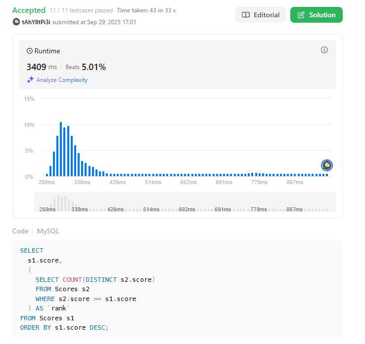

# SQL_ADVANCED 4주차 정규 과제 

## Week 4 : TOP-N 쿼리

📌**SQL_ADVANCED 정규과제**는 매주 정해진 주제에 따라 **MySQL 공식 문서 또는 한글 블로그 자료를 참고해 개념을 정리한 후, 프로그래머스, SolveSql, LeetCode 중에서 SQL 문제 4문제**와 **추가 확인문제**를 직접 풀어보며 학습하는 과제입니다. 

이번 주는 아래의 **SQL_ADVANCED_4th_TIL**에 나열된 주제를 중심으로 개념을 학습하고, 주차별 **학습 목표**에 맞게 정리해주세요. 정리한 내용은 GitHub에 업로드한 후, **스프레드시트의 'SQL' 시트에 링크를 제출**해주세요. 


**(수행 인증샷은 필수입니다.)** 

> 프로그래머스 문제를 풀고 '정답입니다' 문구를 캡쳐해서 올려주시면 됩니다. 


## SQL_ADVANCED_4th

### 15.2.13. SELECT Statement

- `ORDER BY, LIMIT, LIMIT and Subqueries` 중심으로 학습해주세요. 


## 🏁 강의 수강 (Study Schedule)

| 주차  | 공부 범위               | 완료 여부 |
| ----- | ----------------------- | --------- |
| 1주차 | 서브쿼리 & CTE          | ✅         |
| 2주차 | 집합 연산자 & 그룹 함수 | ✅         |
| 3주차 | 윈도우 함수             | ✅         |
| 4주차 | Top N 쿼리              | ✅         |
| 5주차 | 계층형 질의와 셀프 조인 | 🍽️         |
| 6주차 | PIVOT / UNPIVOT         | 🍽️         |
| 7주차 | 정규 표현식             | 🍽️         |


### 공식 문서 활용 팁

>  **MySQL 공식 문서는 영어로 제공되지만, 크롬 브라우저에서 공식 문서를 열고 이 페이지 번역하기에서 한국어를 선택하면 번역된 버전으로 확인할 수 있습니다. 다만, 번역본은 문맥이 어색한 부분이 종종 있으니 영어 원문과 한국어 번역본을 왔다 갔다 하며 확인하거나, 교육팀장의 정리 예시를 참고하셔도 괜찮습니다.**


# 1️⃣ 학습 내용

> 아래의 링크를 통해 *MySQL 공식문서*로 이동하실 수 있습니다.
>
> - 15.2.13 SELECT Statement : MySQL 공식문서 
>
> https://dev.mysql.com/doc/refman/8.0/en/select.html#order-by-optimization
>
> (한국어 버전) https://dart-b-official.github.io/posts/mysql-TopN/
>


<br>

<!-- 여기까진 그대로 둬 주세요-->

---

# 2️⃣ 학습 내용 정리하기

## 1. TOP N 쿼리

~~~
✅ 학습 목표 :
* LIMIT 와 ORDER BY를 이용한 TOP-N 쿼리 작성이 가능하다.
* SubQuery나 RANK 대신 LIMIT으로 간단한 순위 집계가 가능함을 이해한다. 
~~~

### TOP-N 쿼리
- TOP-N 쿼리 : 특정 기준(ex. 점수, 판매량, 날짜 등)에 따라 상위 N개의 행을 조회하는 기법
- `ORDER BY` + `LIMIT` 조합
- 윈도우 함수(`RANK`, `ROW_NUMBER`, `DENSE_RANK`)을 사용하면 그룹별 TOP-N 추출도 가능

### ORDER BY
- 결과 집합을 특정 컬럼 기준 정렬
- default 오름차순, 내림차순은 `DESC`
- 여러 컬럼을 동시에 정렬 가능
```SQL
SELECT name, score
FROM Students
ORDER BY score DESC;
```

### LIMIT
- 반환할 행의 개수 또는 시작 위치 지정
- `LIMIT n` -> 처음 n개의 행
- `LIMIT offset, count` -> offset + 1번째 행부터 count
```SQL
SELECT name, score
FROM Students
ORDER BY score DESC
LIMIT 5;
```

### TOP-N 쿼리 활용
1) 전체에서 상위 N개
```SQL
SELECT *
FROM Sales
ORDER BY revenue DESC
LIMIT 3;
```
-> 매출 기준 상위 3개 행

2) 그룹별 상위 N개
```SQL
SELECT region, restaurant_name, review_count
FROM (
    SELECT region,
        restaurant_name, 
        review_count,
        ROW_NUMBER() OVER (PARTITION BY region ORDER BY review_count DESC) AS rn
    FROM Restaurants
) ranked
WHERE rn <= 2;
```
-> 지역별 리뷰 수 기준 상위 2개 식당 조회

```text
단순 상위 N개 -> ORDER BY + LIMIT
그룹별 상위 N개 -> ROW_NUMBER, RANK
```

### OFFSET 
- `LIMIT {row_count} OFFSET {offset}` 구문을 사용해 특정 위치부터 행 반환
- 페이지네이션 구현에 쓰임
- offset이 커질수록 성능 저하 가능성 有
```SQL
SELECT *
FROM tbl
ORDER BY created_at DESC
LIMIT 10 OFFSET 10
```

### GROUP BY + HAVING TOP-N
- `GROUP BY` : 행 그룹화할 때 사용
- `HAVING` : 그룹화된 결과에 조건을 적용
- TOP-N 문제에서 `GROUP BY`로 합산/평균값 구한 뒤`ORDER BY + LIMIT`으로 상위 그룹을 추출
```SQL
SELECT dept, MAX(salary) AS max_salary
FROM employees
GROUP BY dept
ORDER BY max_salary DESC
LIMIT 3;
```

### Subquery, LIMIT
- LIMIT 은 서브쿼리 안에서 사용 가능
```SQL
SELECT s.*
FROM Students s
JOIN (
  SELECT id
  FROM Students
  ORDER BY score DESC
  LIMIT 5
) top_students
ON s.id = top_students.id;
```

<br>

<br>

---

# 3️⃣ 실습 문제

## 문제 

https://leetcode.com/problems/rank-scores/

> LeetCode 178. Rank Scores
>
> 학습 포인트 : DENSE_RANK( )를 활용하여 점수별 순위 부여, 동점자 처리, 윈도우 함수 복습 

https://school.programmers.co.kr/learn/courses/30/lessons/133027

> 프로그래머스 : 주문량이 많은 아이스크림들 조회하기 (Lev 4)
>
> Hint
>
> - 문제 핵심은 '총 주문량 합산' 입니다. 
>
> - 두 테이블을 '세로로' 합쳐야합니다. 
>   - 저희는 이 부분을 1주차에 `UNION ALL` 을 통해 방법을 배웠습니다. 
> - 합쳐진 테이블에서 FLAVOR 별로 그룹화해 주문량을 합산하세요. 
> - 상위 3개를 추출 = 주문량 기준으로 내림차순하여 이번에 학습한 것을 사용해야 합니다. 

---

## 문제 인증란




---

# 확인문제

## 문제 1

> **🧚영리는 지역별로 가장 인기 있는 식당 2곳씩을 뽑기 위해 다음과 같은 UNION ALL 기반 쿼리를 작성했습니다.**

~~~sql
(
  SELECT region, restaurant_name, review_count
  FROM Restaurants
  WHERE region = '서울'
  ORDER BY review_count DESC
  LIMIT 2
)
UNION ALL
(
  SELECT region, restaurant_name, review_count
  FROM Restaurants
  WHERE region = '부산'
  ORDER BY review_count DESC
  LIMIT 2
)
UNION ALL
(
  SELECT region, restaurant_name, review_count
  FROM Restaurants
  WHERE region = '대구'
  ORDER BY review_count DESC
  LIMIT 2
);
~~~

> **쿼리는 잘 작동하긴 하지만, 지역을 더 추가해달라는 재원이의 부탁으로 UNION ALL 블록을 계속 추가하게 되어 관리가 어려울 것 같아서 힘들어하고 있었습니다. 여러분들은 이 쿼리를 윈도우 함수로 변경하여 더 쉽게 리팩토링을 하려고 합니다. 민서를 도와서 UNION ALL 없이 RANK( ) 또는 ROW_NUMBER( ) 윈도우 함수를 사용해, 각 지역별로 리뷰 수가 가장 많은 상위 2개 식당을 추출하는 쿼리를 작성해보세요.**


~~~SQL
SELECT region, restaurant_name, review_count
FROM (
    SELECT region,
           restaurant_name,
           review_count,
           ROW_NUMBER() OVER (PARTITION BY region ORDER BY review_count DESC) AS rn
    FROM Restaurants
) ranked
WHERE rn <= 2;
~~~


<br>

### 🎉 수고하셨습니다.