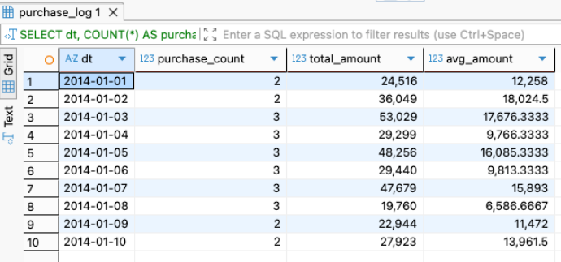
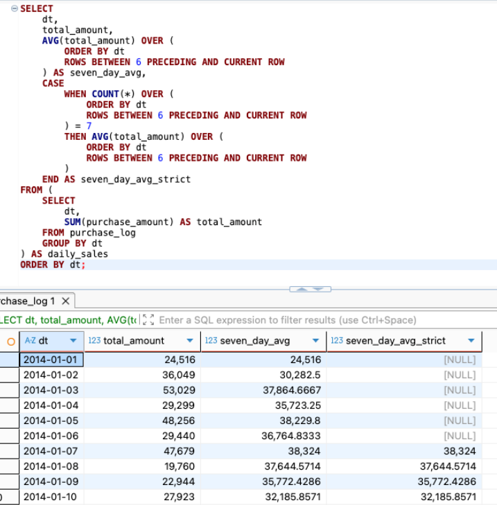
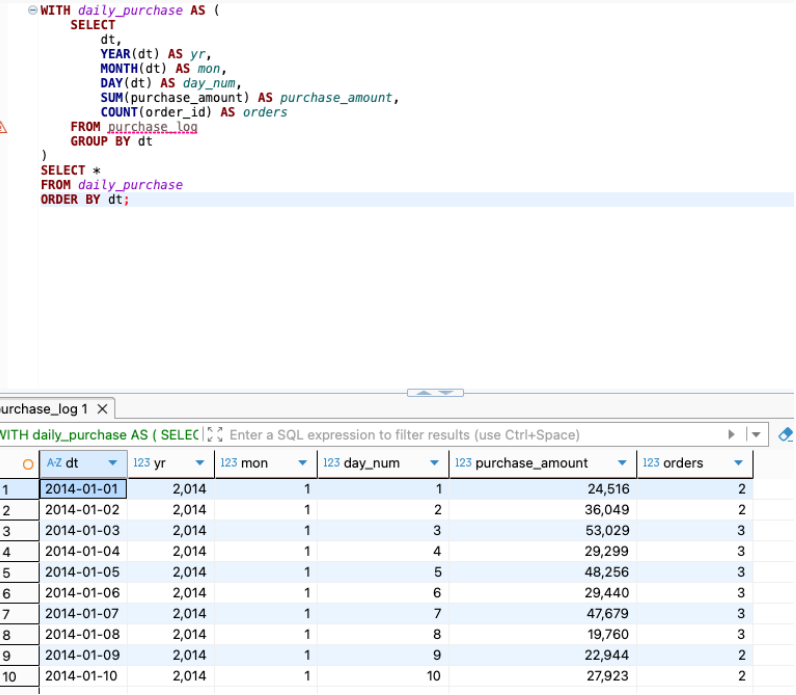
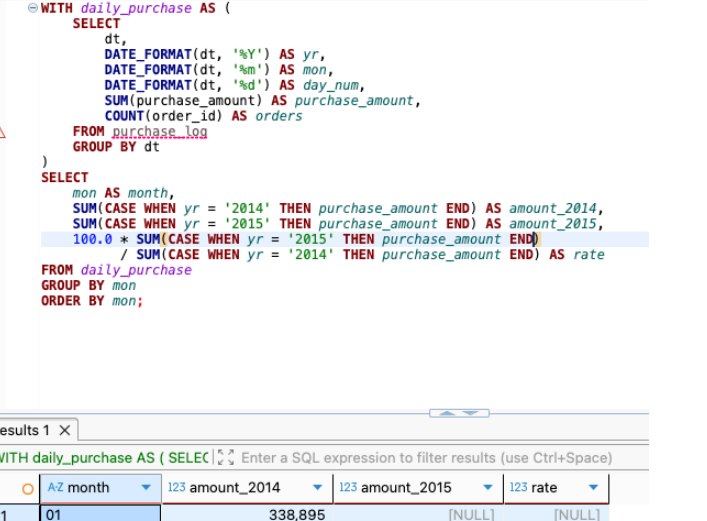
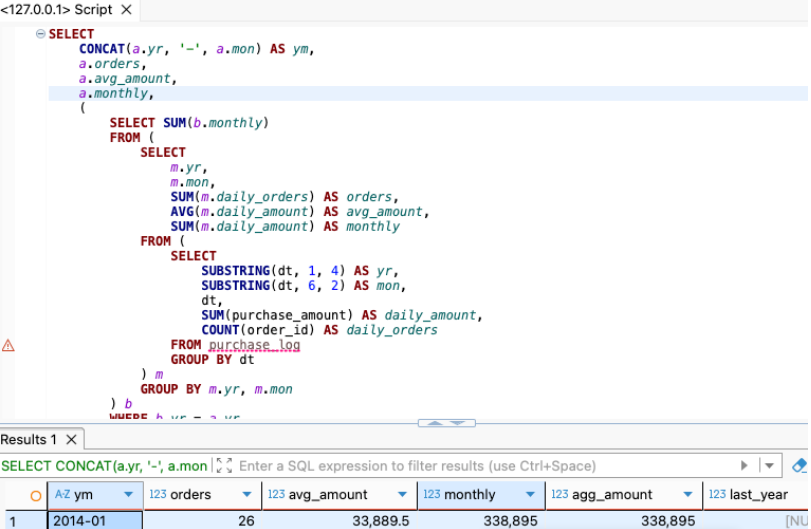
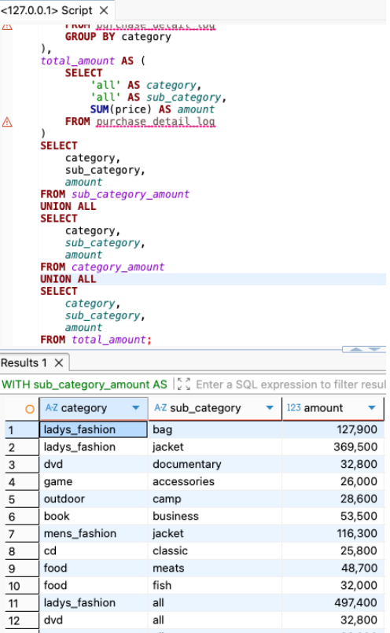
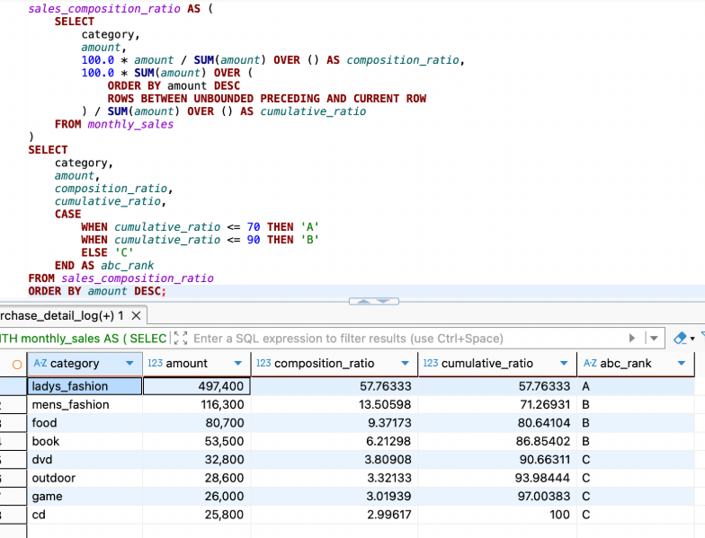
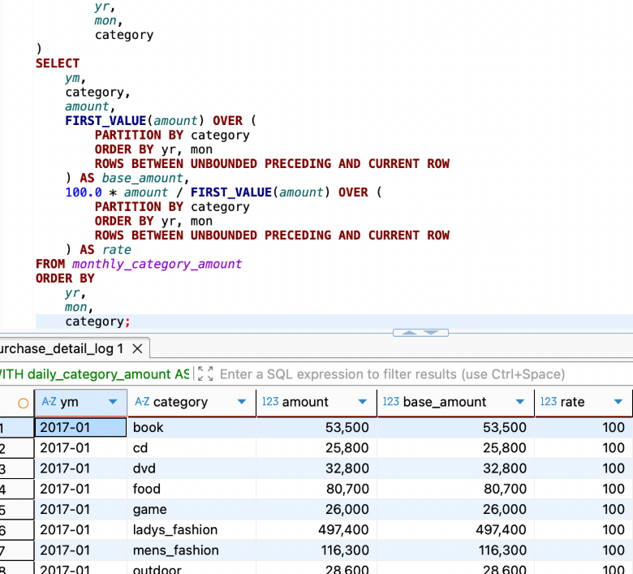
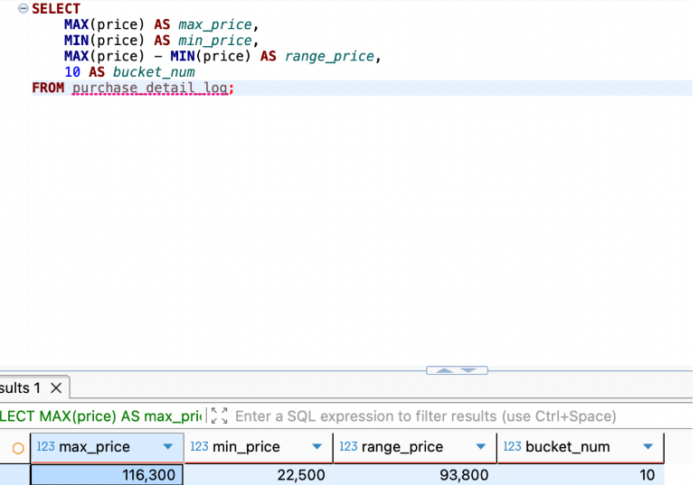

# SQL_MASTER 3주차 정규과제

📌SQL MASTER 정규과제는 매주 정해진 분량의 『*데이터 분석을 위한 SQL 레시피*』 를 읽고 학습하는 것입니다. 이번 주는 아래의 **SQL_MASTER_3rd_TIL**에 나열된 분량을 읽고 공부하시면 됩니다.

아래 실습을 수행하며 학습 내용을 직접 적용해보세요. 단순히 결과를 재현하는 것이 아니라, SQL을 직접 작성하는 과정에서 개념을 스스로 정리하는 것이 중요합니다.

필요한 경우 교재와 추가 자료를 참고하여 이해를 보완하시기 바랍니다.

## SQL_MASTER_3rd_TIL

### 4장 매출을 파악하기 위한 데이터 추출
#### 1. 시계열 기반으로 데이터 집계하기
#### 2. 다면적인 축을 사용해 데이터 집계하기 


## Study Schedule

| 주차  | 공부 범위     | 완료 여부 |
| ----- | ------------- | --------- |
| 1주차 | p.20~50    | ✅         |
| 2주차 | p.52~136   | ✅         |
| 3주차 | p.138~184  | ✅         |
| 4주차 | p.186~232 | 🍽️         |
| 5주차 | p.233~321 | 🍽️         |
| 6주차 | p.324~406 | 🍽️         |
| 7주차 | p.408~464 | 🍽️         |

<br>

<!-- 여기까진 그대로 둬 주세요-->

# 실습

## 0. 실습 규칙

1. 샘플 데이터 생성 코드는 **07_SQL_MASTER_Template/src** 경로에 장별로 정리되어 있습니다.
2. 아래 목차에 맞춰 해당 코드를 실행하여 샘플 데이터를 생성한 후, 각 장에서 요구하는 쿼리를 직접 작성해보시기 바랍니다.
3. 작성한 쿼리의 **실행 결과 화면도 함께 제출**해 주세요.
4. 단순히 교재의 예시 코드를 그대로 작성하는 것이 아니라, **제시된 로직을 충분히 이해한 뒤 교재를 보지 않고 스스로 쿼리를 구성**해보는 것을 권장합니다.
5. 교재 예시는 PostgreSQL, Hive, BigQuery 등 다양한 DBMS 기준으로 제시되어 있기 때문에, **MySQL이 아닌 다른 SQL 환경을 사용하여 실습을 진행해도 무방합니다.**
6. 다만, 사용 중인 DBMS에 맞는 문법으로 적절히 변환하여 작성하시기 바랍니다.


## 1. 시계열 기반으로 데이터 집계하기

### 1-1 날짜별 매출 집계하기

- 가로축: 날짜 / 세로축: 매출 금액 구조로 해석
- 날짜 기준으로 데이터를 그룹화하여 매출을 집계
- 단순 합계뿐 아니라 평균 구매액도 함께 확인하는 것이 중요
  - 날짜 기준 GROUP BY`를 활용한 집계 SQL 작성

```sql
SELECT 
    dt,
    COUNT(*) AS purchase_count,
    SUM(purchase_amount) AS total_amount,
    AVG(purchase_amount) AS avg_amount
FROM purchase_log
GROUP BY dt
ORDER BY dt;
```


 
### 1-2 이동평균을 사용한 날짜별 추이 보기

- 날짜별 매출은 하루 단위 변동이 커서 전체 흐름을 보기 어려울 수 있음  
- 이때 이동평균을 사용하면 단기적인 노이즈를 줄이고 추세를 더 부드럽게 확인 가능
- 여기서는 최근 7일간의 평균 매출을 구해 날짜별 추이를 살펴봄 

```sql
SELECT
    dt,
    total_amount,
    AVG(total_amount) OVER (
        ORDER BY dt
        ROWS BETWEEN 6 PRECEDING AND CURRENT ROW
    ) AS seven_day_avg,
    CASE
        WHEN COUNT(*) OVER (
            ORDER BY dt
            ROWS BETWEEN 6 PRECEDING AND CURRENT ROW
        ) = 7
        THEN AVG(total_amount) OVER (
            ORDER BY dt
            ROWS BETWEEN 6 PRECEDING AND CURRENT ROW
        )
    END AS seven_day_avg_strict
FROM (
    SELECT
        dt,
        SUM(purchase_amount) AS total_amount
    FROM purchase_log
    GROUP BY dt
) AS daily_sales
ORDER BY dt;
```



### 1-3 당월 매출 누계 구하기

- 날짜별 매출만 보면 하루 단위 실적은 확인할 수 있지만, 해당 월에 누적해서 얼마나 매출이 쌓였는지는 바로 파악하기 어려움  
- 이때 윈도우 함수를 사용하면 날짜별 매출과 함께 당월 누적 매출도 동시에 확인 가능
- 즉, 일별 매출 흐름과 월별 누적 진행 상황을 함께 보는 데 적합한 방식

```sql
SELECT
    dt,
    SUBSTRING(dt, 1, 7) AS year_month,
    total_amount,
    SUM(total_amount) OVER (
        PARTITION BY SUBSTRING(dt, 1, 7)
        ORDER BY dt
        ROWS BETWEEN UNBOUNDED PRECEDING AND CURRENT ROW
    ) AS agg_amount
FROM (
    SELECT
        dt,
        SUM(purchase_amount) AS total_amount
    FROM purchase_log
    GROUP BY dt
) AS daily_sales
ORDER BY dt;
```



### 1-4 월별 매출의 작대비 구하기

- 월별 매출 추이를 확인하면 특정 시기에 매출이 증가했는지 감소했는지 파악 가능
- 여기에 작년 같은 달 매출과 비교하면 계절성이나 성장 여부를 더 명확하게 해석 가능
- 전년 동월 대비 매출을 비교하여 상승·하락 여부를 한눈에 확인하는 리포트를 만드는 것이 목적

```sql
WITH daily_purchase AS (
    SELECT
        dt,
        SUBSTRING(dt, 1, 4) AS year,
        SUBSTRING(dt, 6, 2) AS month,
        SUBSTRING(dt, 9, 2) AS date,
        SUM(purchase_amount) AS purchase_amount,
        COUNT(order_id) AS orders
    FROM purchase_log
    GROUP BY dt
)
SELECT
    month,
    SUM(CASE year WHEN '2014' THEN purchase_amount END) AS amount_2014,
    SUM(CASE year WHEN '2015' THEN purchase_amount END) AS amount_2015,
    100.0 * SUM(CASE year WHEN '2015' THEN purchase_amount END)
          / SUM(CASE year WHEN '2014' THEN purchase_amount END) AS rate
FROM daily_purchase
GROUP BY month
ORDER BY month;
```


 
### 1-5 Z 차트로 업적의 추이 확인하기

- Z 차트는 `월차매출`, `매출누계`, `이동년계` 3개의 지표를 함께 보여주는 분석 방식
- 단순히 한 달 매출만 보는 것이 아니라, 누적 흐름과 최근 1년 기준의 흐름까지 함께 확인 가능
- 계절적 변동의 영향을 줄이고 장기적인 매출 트렌드를 파악하는 데 자주 사용

#### Z 차트의 구성 요소

- `월차매출`  
  → 해당 월의 총매출임  
- `매출누계`  
  → 해당 연도에서 1월부터 현재 월까지 누적한 매출임  
- `이동년계`  
  → 해당 월을 포함해 최근 12개월의 매출 합계임  
  → 현재 월 + 과거 11개월을 더한 값임  

```sql
WITH daily_purchase AS (
    SELECT
        dt,
        SUBSTRING(dt, 1, 4) AS year,
        SUBSTRING(dt, 6, 2) AS month,
        SUBSTRING(dt, 9, 2) AS date,
        SUM(purchase_amount) AS purchase_amount,
        COUNT(order_id) AS orders
    FROM purchase_log
    GROUP BY dt
),
monthly_amount AS (
    SELECT
        year,
        month,
        SUM(purchase_amount) AS amount
    FROM daily_purchase
    GROUP BY year, month
),
calc_index AS (
    SELECT
        year,
        month,
        amount,
        SUM(
            CASE
                WHEN year = '2015' THEN amount
            END
        ) OVER (
            ORDER BY year, month
            ROWS UNBOUNDED PRECEDING
        ) AS agg_amount,
        SUM(amount) OVER (
            ORDER BY year, month
            ROWS BETWEEN 11 PRECEDING AND CURRENT ROW
        ) AS year_avg_amount
    FROM monthly_amount
    ORDER BY year, month
)
SELECT
    CONCAT(year, '-', month) AS year_month,
    amount,
    agg_amount,
    year_avg_amount
FROM calc_index
WHERE year = '2015'
ORDER BY year_month;
```


 
### 1-6 매출을 파악할 때 중요 포인트 

- 매출을 분석할 때는 단순히 총매출만 보는 것으로는 충분하지 않음
- 주문 수, 평균 구매액, 월별 매출, 누적 매출, 전년 동월 대비 변화율까지 함께 확인해야 매출 구조를 더 정확히 이해 가능
- 즉, **매출 규모**, **구매 빈도**, **객단가**, **누적 흐름**, **전년 대비 증감**을 함께 보는 것이 중요

```sql
WITH daily_purchase AS (
    SELECT
        dt,
        SUBSTRING(dt, 1, 4) AS year,
        SUBSTRING(dt, 6, 2) AS month,
        SUBSTRING(dt, 9, 2) AS date,
        SUM(purchase_amount) AS purchase_amount,
        COUNT(order_id) AS orders
    FROM purchase_log
    GROUP BY dt
),
monthly_purchase AS (
    SELECT
        year,
        month,
        SUM(orders) AS orders,
        AVG(purchase_amount) AS avg_amount,
        SUM(purchase_amount) AS monthly
    FROM daily_purchase
    GROUP BY year, month
)
SELECT
    CONCAT(year, '-', month) AS year_month,
    orders,
    avg_amount,
    monthly,
    SUM(monthly) OVER (
        PARTITION BY year
        ORDER BY month
        ROWS UNBOUNDED PRECEDING
    ) AS agg_amount,
    LAG(monthly, 12) OVER (
        ORDER BY year, month
    ) AS last_year,
    100.0 * monthly /
    LAG(monthly, 12) OVER (
        ORDER BY year, month
    ) AS rate
FROM monthly_purchase
ORDER BY year_month;
```

## 2. 다면적인 축을 사용해 데이터 집계하기 

### 2-1 카테고리별 매출과 소계 계산하기

- 매출 데이터를 분석할 때는 세부 카테고리별 매출만 보는 것보다, 상위 카테고리의 소계와 전체 합계까지 함께 보는 것이 유용함  
- 이렇게 하면 세부 항목별 성과와 상위 분류 기준의 전체 흐름을 동시에 파악 가능
- 즉, **세부 카테고리 매출 + 카테고리 소계 + 전체 합계**를 한 번에 조회하는 것이 목적

```sql
WITH sub_category_amount AS (
    SELECT
        category,
        sub_category,
        SUM(price) AS amount
    FROM purchase_detail_log
    GROUP BY category, sub_category
),
category_amount AS (
    SELECT
        category,
        'all' AS sub_category,
        SUM(price) AS amount
    FROM purchase_detail_log
    GROUP BY category
),
total_amount AS (
    SELECT
        'all' AS category,
        'all' AS sub_category,
        SUM(price) AS amount
    FROM purchase_detail_log
)
SELECT
    category,
    sub_category,
    amount
FROM sub_category_amount
UNION ALL
SELECT
    category,
    sub_category,
    amount
FROM category_amount
UNION ALL
SELECT
    category,
    sub_category,
    amount
FROM total_amount;
```



### 2-2 ABC 분석으로 잘 팔리는 상품 판별하기

- ABC 분석은 재고 관리와 매출 분석에서 자주 사용하는 방법
- 상품별 매출 기여도를 기준으로 중요도를 나누고, 그에 따라 서로 다른 관리 전략을 세우는 데 활용
- 즉, **어떤 상품이 전체 매출에서 얼마나 큰 비중을 차지하는지**를 기준으로 우선순위를 정하는 방식

```sql
WITH monthly_sales AS (
    SELECT
        category,
        SUM(price) AS amount
    FROM purchase_detail_log
    WHERE dt BETWEEN '2015-12-01' AND '2015-12-31'
    GROUP BY category
),
sales_composition_ratio AS (
    SELECT
        category,
        amount,
        100.0 * amount / SUM(amount) OVER () AS composition_ratio,
        100.0 * SUM(amount) OVER (
            ORDER BY amount DESC
            ROWS BETWEEN UNBOUNDED PRECEDING AND CURRENT ROW
        ) / SUM(amount) OVER () AS cumulative_ratio
    FROM monthly_sales
)
SELECT
    *,
    CASE
        WHEN cumulative_ratio <= 70 THEN 'A'
        WHEN cumulative_ratio <= 90 THEN 'B'
        ELSE 'C'
    END AS abc_rank
FROM sales_composition_ratio
ORDER BY amount DESC;
```



### 2-3 팬 차트로 상품의 매출 증가율 확인하기

- 팬 차트는 특정 시점의 값을 100으로 두고, 이후 값이 얼마나 증가하거나 감소했는지를 비율로 비교하는 방식
- 절대 매출액 자체보다 **기준 시점 대비 변화율**에 초점을 맞추기 때문에, 카테고리별 성장 흐름을 비교할 때 유용
- 즉, 카테고리마다 시작 매출 규모가 달라도 같은 기준선에서 증감 추이를 볼 수 있음

#### 팬 차트의 핵심 개념

- 기준 시점의 값을 100%로 둠  
- 이후 각 시점의 값을 기준 시점 대비 몇 %인지 계산함  
- 이를 통해 카테고리별 매출 증가율이나 감소율을 직관적으로 비교할 수 있음  
- 절대 매출이 큰 카테고리와 작은 카테고리도 동일한 기준으로 변화 추이를 볼 수 있음  

```sql
WITH daily_category_amount AS (
    SELECT
        dt,
        category,
        SUBSTRING(dt, 1, 4) AS year,
        SUBSTRING(dt, 6, 2) AS month,
        SUBSTRING(dt, 9, 2) AS date,
        SUM(price) AS amount
    FROM purchase_detail_log
    GROUP BY
        dt,
        category
),
monthly_category_amount AS (
    SELECT
        CONCAT(year, '-', month) AS year_month,
        category,
        SUM(amount) AS amount
    FROM daily_category_amount
    GROUP BY
        year,
        month,
        category
)
SELECT
    year_month,
    category,
    amount,
    FIRST_VALUE(amount) OVER (
        PARTITION BY category
        ORDER BY year_month, category
        ROWS BETWEEN UNBOUNDED PRECEDING AND CURRENT ROW
    ) AS base_amount,
    100.0 * amount / FIRST_VALUE(amount) OVER (
        PARTITION BY category
        ORDER BY year_month, category
        ROWS BETWEEN UNBOUNDED PRECEDING AND CURRENT ROW
    ) AS rate
FROM monthly_category_amount
ORDER BY
    year_month,
    category;
```



### 2-4 히스토그램으로 구매 가격대 집계하기 

- 히스토그램은 연속형 데이터의 분포를 구간별로 나누어 확인하는 방법 
- 가로축에는 가격 구간, 세로축에는 해당 구간에 속하는 데이터 개수를 둠 
- 이를 통해 어떤 가격대에 구매가 가장 많이 몰려 있는지, 즉 최빈 구간을 파악하기 쉬움 

#### 히스토그램

- `가로축` : 계급 또는 구간임  
- `세로축` : 각 구간에 속하는 데이터 개수, 즉 도수임  
- 연속된 수치를 몇 개의 구간으로 나누고 각 구간별 빈도를 계산하는 방식임  
- 데이터가 어느 범위에 집중되어 있는지 시각적으로 확인할 때 유용함  

```sql
WITH stats AS (
    SELECT
        MAX(price) AS max_price,
        MIN(price) AS min_price,
        MAX(price) - MIN(price) AS range_price,
        10 AS bucket_num
    FROM purchase_detail_log
)
SELECT
    *
FROM stats;
```




### 🎉 수고하셨습니다.