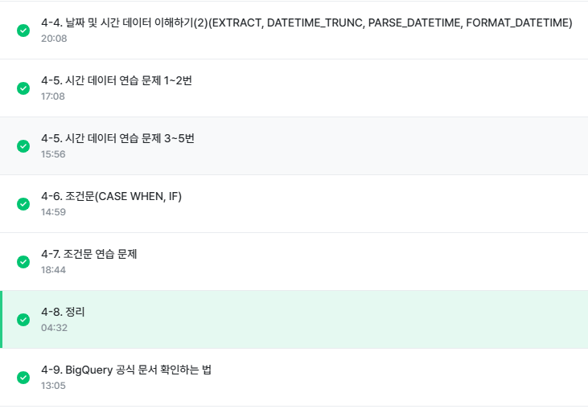

# 데이터 타입에 따른 함수 정리
## 1. 숫자
- 사칙연산

## 2. 문자
- CONCAT
- SPLIT
- REPLACE
- TRIM
- UPPER

## 3. 시간, 날짜
(1) DATETIME 함수
- CURRENT_DATETIME([time_zone]) : 현재 DATETIME 출력
  - ⚠️current_datetime_asia 와 다름

- EXTRACT 함수 : DATETIME 에서 특정 부분만 추출하고 싶은 경우
```SQL
SELECT
 EXTRACT(DATE FROM DATETIME "2025-01-01 12:00:00") AS date,
 EXTRACT(YEAR FROM DATETIME "2025-01-01 12:00:00") AS year,
 EXTRACT(MONTH FROM DATETIME "2025-01-01 12:00:00") AS month,
 EXTRACT(DAY FROM DATETIME "2025-01-01 12:00:00") AS day,
 EXTRACT(HOUR FROM DATETIME "2025-01-01 12:00:00") AS hour,
 EXTRACT(MINUTE FROM DATETIME "2025-01-01 12:00:00") AS minute
 ```
 결과는 2025-01-01, 2025, 1, 1, 12, 0 
 
  - 요일을 추출하고 싶으면? `EXTRACT(DAYOFWEEK FROM datetime_col)`
    - 한 주의 첫날이 일요일인 [1, 7] 범위의 값 반환 - 각 요일마다 숫자 1~7 숫자 할당 

- DATETIME_TRUNC(datetime_col, HOUR) : 분, 초 버리고 hour까지만 표현
- PARSE_DATETIME : 문자열로 저장된 DATETIME 을 DATETIME 타입으로 바꾸고 싶은 경우(문자열을 datetype에 맞게 파싱하는 과정)
```SQL
PARSE_DATETIME('%Y-%m-%d %H:%M:%S', '2025-01-01 12:00:00') AS parse_datetime;
```

- FORMAT_DATETIME : DATETIME 타입 데이터를 특정 형태의 문자열 데이터로 변환
```SQL
 FORMAT_DATETIME("%c", DATETIME "2025-01-01 12:00:00") AS formatted;
 ```

 - LAST_DAY : 마지막 날을 알고 싶은 경우
 ```SQL
 LAST_DAY(DATETIME)
 # 월의 마지막 값을 반환(디폴트)
 LAST_DAY(DATETIME, '2025-01-01 12:00:00', WEEK) AS last_day_week
 # WEEK 시작 디폴트 SUNDAY, 만약 다르게 할 경우 WEEK(TUESDAY)와 같이 해야함
 ```

- DATETIME_DIFF : 두 DATETIME의 차이를 알고 싶은 경우
```SQL
DATETIME_DIFF(첫 DATETIME, 두번째 DATETIME, 궁금한 차이)
DATETIME_DIFF(first_datetime, second_datetime, DAY) AS day_diff1
```

(2) 기타
- TIMESTAMP : 특정 시점에 도장찍은 값. 타임존 정보 O
- UTC : 국제적인 표준시간. 한국은 UTC+9

## 조건문 함수
(1) CASE_WHEN : 여러 조건이 있을 때 유용
```SQL
SELECT
 CASE
  WHEN 조건1 THEN 조건1이 참일 경우 결과
  WHEN 조건2 THEN 조건2가 참일 경우 결과 
  ELSE 그 외 조건일 경우 결과
END AS 새로운_컬럼_이름
```
⚠️ 위에서부터 읽어나가기 때문에 조건이 여러 개일 경우 순서에 주의해야함
  - 50이상 strong, 100 이상 very strong -> 100 이상을 위에 표시해야함. 만약 50이상이 먼저라면 100이상의 값도 50이상의 처리가 되기에 원하는 결과가 나오지 않음

(2) IF : 단일 조건일 때 유용
```SQL
IF(조건문, True일 때의 값, False일 때의 값) AS 새로운_컬럼_이름
```
😲python, c에서는 if를 많이 쓰는데 SQL 은 조건 여러개면 case_when을 쓰는구나..